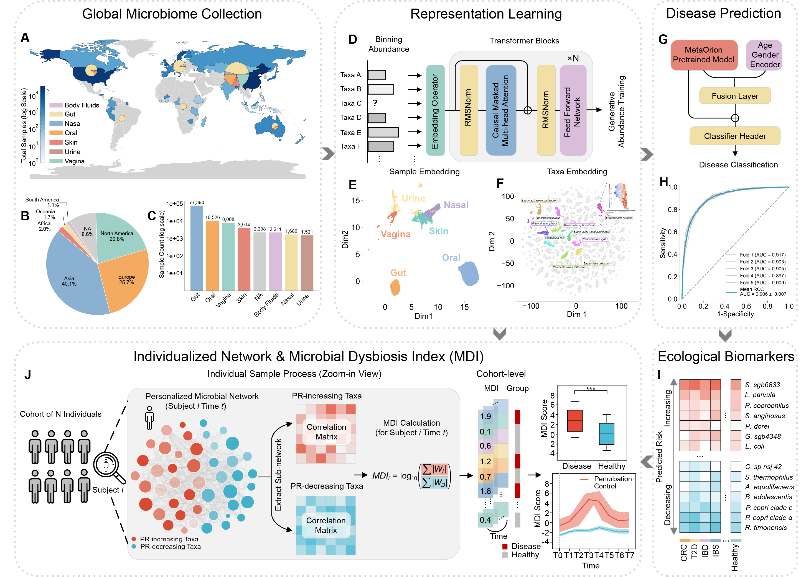

# MetaOrion

MetaOrion is a species-level, abundance-aware representation learning framework designed for personalized metagenomics. Built on a customized causal transformer architecture, it is pretrained on a harmonized collection of over 100,000 human metagenomes to capture transferable ecological priors, and subsequently fine-tuned for disease prediction.

Beyond classification, MetaOrion identifies critical condition-specific biomarkers and leverages its learned embeddings to reconstruct individualized microbial interaction networks directly from single-sample taxonomic profiles. Based on these networks, the framework derives a Microbial Dysbiosis Index (MDI) to quantify structural ecological shifts. MetaOrion provides a unified framework for understanding microbiome organization across health and disease.



## Overview

MetaOrion supports the following analysis tasks:

- Species-level metagenomic representation learning from taxonomic abundance profiles.
- Phenotype and disease prediction through downstream fine-tuning.
- Condition-specific biomarker attribution.
- Individualized microbial interaction network reconstruction.
- Microbial Dysbiosis Index calculation for quantifying ecological perturbation.

## Repository Structure

The main tracked directories are organized as follows. Local outputs, checkpoints, temporary files, IDE settings, and other ignored artifacts are intentionally omitted.

```text
MetaOrion/
├── configs/                 # Runtime configuration files
├── demo_data/               # Example taxonomic profiles, metadata, and datapath files
├── experiment/              # Downstream analysis and visualization scripts
├── figs/                    # Figures used in the documentation
├── scripts/                 # Entry scripts for preprocessing, training, evaluation, and attribution
├── src/
│   └── metaorion/
│       ├── basic/           # Tokenizer, datasets, kernels, and utilities
│       ├── config/          # Model configuration classes
│       ├── inference/       # Phenotype inference, sequence inference, and attribution modules
│       ├── models/          # Pretraining and fine-tuning model architectures
│       └── train/           # Training logic for phenotype prediction
├── requirements.txt         # Python dependencies
└── run.train.sh             # Example training commands
└── run.inference.sh         # Example inference commands
```

## Installation

Create a clean Python environment and install the required dependencies:

```bash
pip install -r requirements.txt
```

Alternatively, dependencies can be installed with conda:

```bash
conda install --yes --file requirements.txt
```

## Demo Data

The example data are provided under `demo_data/`.

- `13_Ning_2023.profile`: a species-level abundance profile table, where rows are taxa and columns are samples.
- `13_Ning_2023.info`: sample metadata. The preprocessing script reads the `Group` column and maps disease names to unified labels.
- `datapaths/`: example preprocessed JSON samples and datapath index files.

After preprocessing, each sample is stored as an individual JSON file:

```json
{
  "sampleid": "sample_id",
  "taxa": ["s__example_species"],
  "abundance": [0.001],
  "disease_united": "healthy"
}
```

The `disease_united` field is generated when metadata are provided and sample labels can be matched.

## Data Preprocessing

Run the preprocessing script from the project root:

```bash
python scripts/data_preprocess.py \
  --cohort 13_Ning_2023 \
  --profile demo_data/13_Ning_2023.profile \
  --metadata demo_data/13_Ning_2023.info \
  --out_dir demo_data/datapaths
```

Main arguments:

- `--cohort`: cohort or dataset name.
- `--profile`: path to the taxonomic abundance profile.
- `--metadata`: path to the metadata file. This argument is optional.
- `--out_dir`: output directory for JSON samples and datapath files.
- `--min_abundance`: minimum abundance threshold. The default value is `1e-4`.
- `--min_len`: minimum number of retained species per sample. The default value is `7`.

## Phenotype Model Fine-Tuning

The phenotype fine-tuning entry point is `scripts/finetune_phenotype_model.py`. It iterates over five data splits and calls `MetaOrionPhenotypeTrainer`.

```bash
accelerate launch \
  --config_file configs/accelerate_config.yaml \
  scripts/finetune_phenotype_model.py \
  --data_dir /path/to/split_datapaths \
  --model_name_or_path /path/to/pretrained_checkpoint \
  --batch_size 48 \
  --max_epochs 100 \
  --learning_rate 1e-4 \
  --weight_decay 1e-3 \
  --decay_gamma 0.9 \
  --decay_step 10 \
  --mixed_precision fp16 \
  --accumulation_step 2 \
  --output_home /path/to/output
```

The expected split files follow this layout:

```text
split1/datapath.pandisease.train.all
split1/datapath.pandisease.val
...
split5/datapath.pandisease.train.all
split5/datapath.pandisease.val
```

## Phenotype Model Evaluation

The phenotype evaluation entry point is `scripts/evaluation_phenotype_model.py`. It loads the checkpoint for each split and evaluates disease prediction performance on the corresponding test datapath.

```bash
accelerate launch \
  --config_file configs/accelerate_config.yaml \
  scripts/evaluation_phenotype_model.py \
  --data_dir /path/to/split_datapaths \
  --cohort 13_Ning_2023 \
  --model_name_or_path /path/to/model_checkpoints \
  --batch_size 48 \
  --mixed_precision fp16 \
  --accumulation_step 2 \
  --output_home /path/to/output \
  --seed 42
```

The expected test files follow this layout:

```text
split1/datapath.13_Ning_2023.test
...
split5/datapath.13_Ning_2023.test
```

## Additional Scripts

- `scripts/attribute_phenotype_model.py`: feature attribution for phenotype models.
- `scripts/evaluation_sequence_model.py`: sequence model evaluation.
- `experiment/`: scripts for MDI analysis, network analysis, visualization, and downstream comparisons.

## Notes

- Large model checkpoints and local experiment outputs should be kept outside the tracked source tree or in ignored local directories.
- Before running fine-tuning or evaluation, make sure `--model_name_or_path` points to a valid model checkpoint directory.
- Paths in the command examples are templates and should be replaced with paths in your local environment.
